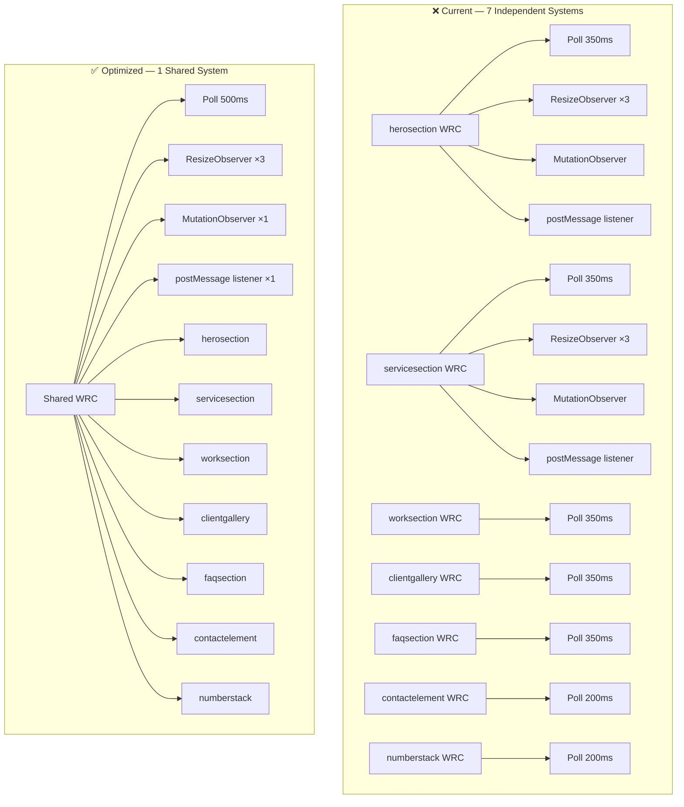

# Performance Optimization Plan — Desktop + Mobile
## Narrative Hook Custom Components

> [!NOTE]
> **Scope:** All 9 component files. Both desktop/laptop AND mobile views.  
> **Constraint:** Pure vanilla JS edits — no build pipeline, no bundler.  
> **Guarantee:** Zero visual changes — identical output on all devices.

---

## Architecture Diagram — Current vs Optimized



---

## Impact Summary

| Metric | Before | After | Improvement |
|--------|--------|-------|-------------|
| Polling loops at startup | 9 concurrent | 1 shared | **~89% reduction** |
| ResizeObserver instances | 9 (27 observe calls) | 1 (3 observe calls per component, shared core) | **~67% reduction** |
| MutationObserver instances | 7 | 1 (or 0 on mobile) | **~86% reduction** |
| postMessage listeners | 9 | 1 | **~89% reduction** |
| RAF loops running when off-screen | 3-4 always-on | 0 (paused) | **100% savings** |
| Google Fonts CSS loads | 7 | 1 | **6 fewer requests** |
| Duplicate JS lines | ~1,225 | 0 | **~1,225 lines removed** |
| Client gallery images (mobile) | 72 cards | 48 cards | **~33% fewer DOM nodes** |
| Trail images on mobile | 16 img elements | 0 | **16 fewer DOM nodes** |
| backdrop-filter layers on mobile | ~20+ | 0 | **Major GPU relief** |

---

## Phase 1 — WixResponsiveCore Deduplication

> [!IMPORTANT]
> **Impact:** 🔴 Critical — single highest-impact change for BOTH desktop and mobile.  
> **Risk:** Low — WRC API is identical across all copies.

**What's happening now:**  
7 components each define their own full copy of WRC. On page load, this creates **7 independent reactivity systems** all running simultaneously — 7 polling loops, 7 ResizeObservers (each triple-observing), 7 MutationObservers, 7 postMessage listeners. This is the #1 cause of both desktop and mobile lag.

**What we'll do:**  
Make WRC a **singleton** — the first component to load defines it on `window`, all others reuse it. Each component still calls `WRC.init(this)` individually so it tracks its own width, but they **share** the underlying observer/polling infrastructure.

### File Changes

#### [MODIFY] [herosection.js](file:///c:/Users/Vaviya/OneDrive/Desktop/Narrative%20hook%20code/herosection.js)
- This file uses a custom responsive system (not the standard WRC copy). Has its own `_remeasureLines()` tied to a private `ResizeObserver`
- **Change:** Wrap its responsive logic to use the shared WRC singleton via `_onWidth(w, bp)` callback
- Keep the line-specific `ResizeObserver` (it watches hero-inner, not the host) but debounce it more aggressively
- Remove its own polling/postMessage width logic

#### [MODIFY] [clientgallery.js](file:///c:/Users/Vaviya/OneDrive/Desktop/Narrative%20hook%20code/clientgallery.js)
- Lines 8-211: Full WRC copy
- **Change:** Wrap in `if (typeof window._WRC_SHARED === 'undefined') { ... window._WRC_SHARED = WRC; }` pattern
- All other components reference `window._WRC_SHARED` (or define it themselves if they load first)

#### [MODIFY] [faqsection.js](file:///c:/Users/Vaviya/OneDrive/Desktop/Narrative%20hook%20code/faqsection.js)
- Lines 38-176: Full WRC copy
- **Change:** Same singleton pattern — check for `window._WRC_SHARED`, define only if missing

#### [MODIFY] [contactelement.js](file:///c:/Users/Vaviya/OneDrive/Desktop/Narrative%20hook%20code/contactelement.js)
- Lines 58-88: Custom `resolveWidth()` function
- Lines 242-320: 5-channel reactivity system (mirrors WRC)
- **Change:** Replace entire custom system with shared WRC. Map `_applyWidth(w)` to `_onWidth(w, bp)` callback
- **Saves ~260 lines** and eliminates 1 polling loop + 1 ResizeObserver + 1 MutationObserver

#### [MODIFY] [servicesection.js](file:///c:/Users/Vaviya/OneDrive/Desktop/Narrative%20hook%20code/servicesection.js)
- Has its own multi-channel reactivity
- **Change:** Delegate to shared WRC, keep `_onWidth` for breakpoint-driven layout switches

#### [MODIFY] [numberstack.js](file:///c:/Users/Vaviya/OneDrive/Desktop/Narrative%20hook%20code/numberstack.js)
- Lines 77-113: `_setupWidthObserver()` with ResizeObserver + polling
- **Change:** Replace with shared WRC. Map the `apply()` logic to `_onWidth(w, bp)` callback

#### [MODIFY] [teamscroll.js](file:///c:/Users/Vaviya/OneDrive/Desktop/Narrative%20hook%20code/teamscroll.js)
- Lines 286-301: `setupResizeObserver()` 
- **Change:** Replace with shared WRC. Map `_updateFanScale(mw)` to `_onWidth(w, bp)` callback

---

## Phase 2 — Off-Screen RAF Pausing (Desktop + Mobile)

> [!IMPORTANT]
> **Impact:** 🔴 Critical for desktop — stops 3-4 animation loops from running when scrolled away.  
> **Risk:** Low — pausing is invisible to the user.

**What's happening now:**  
Once started, these RAF loops run **forever** regardless of scroll position:
- `herosection.js` — line physics + color blend (~60fps on desktop, ~30fps mobile)
- `numberstack.js` — card transforms + progress bar (~20fps)
- `teamscroll.js` — eye-tracking (~60fps, desktop only)
- `clientgallery.js` — marquee scroll animation (~60fps)

When you scroll to the footer, **all 4 loops are still consuming CPU** even though none of those sections are visible.

**What we'll do:**  
Add an `IntersectionObserver` to each component that **pauses its RAF loop** when the section leaves the viewport, and **resumes** when it re-enters.

### File Changes

#### [MODIFY] [herosection.js](file:///c:/Users/Vaviya/OneDrive/Desktop/Narrative%20hook%20code/herosection.js)
```javascript
// Add to connectedCallback, after _startLoop()
this._heroIo = new IntersectionObserver(([e]) => {
  if (e.isIntersecting) { if (!this._rafId) this._startLoop(); }
  else { cancelAnimationFrame(this._rafId); this._rafId = null; }
}, { rootMargin: '100px' });
this._heroIo.observe(this);
```
- Also pause `_frameTimer` (setInterval for frame counter) when off-screen
- Also pause `_rectRefreshTimer` (100ms BCR polling) when off-screen
- **Desktop impact:** When user scrolls past hero, 60fps RAF + 100ms interval both stop immediately

#### [MODIFY] [numberstack.js](file:///c:/Users/Vaviya/OneDrive/Desktop/Narrative%20hook%20code/numberstack.js)
- The RAF loop (`_startRafLoop`, line 580) runs at ~20fps doing `_updateCards()` which reads BCR on every card
- **Change:** Add IO gate — stop loop when section exits viewport, restart on re-entry
- Already stops on `xs`/`narrow`, but on desktop/medium it runs forever

#### [MODIFY] [teamscroll.js](file:///c:/Users/Vaviya/OneDrive/Desktop/Narrative%20hook%20code/teamscroll.js)
- Eye-tracking RAF (`startEyeTracking`, line 747) runs 60fps on desktop
- **Change:** Add IO gate — when team section scrolls off-screen, cancel RAF. Resume on re-enter
- **Desktop impact:** This is likely the single biggest desktop CPU drain after WRC duplication

#### [MODIFY] [clientgallery.js](file:///c:/Users/Vaviya/OneDrive/Desktop/Narrative%20hook%20code/clientgallery.js)
- Marquee animation (`_startAnimation`, around line 800+) runs continuously
- **Change:** Add IO gate — pause when gallery is off-screen

---

## Phase 3 — Mobile Animation Gatekeeping

> **Impact:** 🟠 High for mobile. Desktop is unaffected (all effects preserved).

### File Changes

#### [MODIFY] [herosection.js](file:///c:/Users/Vaviya/OneDrive/Desktop/Narrative%20hook%20code/herosection.js)
- **Reduce mobile RAF to 15fps** — change `33ms` gate (line 1123) to `66ms`. Color blend is imperceptible at 15fps
- **Skip image trail creation on mobile** — wrap `_initTrail()` call in `if (!window.matchMedia('(pointer: coarse)').matches)` — currently 16 img elements are created in DOM for nothing
- **Kill `_rectRefreshTimer` on mobile** — use WRC `_onWidth` callback instead of polling BCR every 100ms

#### [MODIFY] [numberstack.js](file:///c:/Users/Vaviya/OneDrive/Desktop/Narrative%20hook%20code/numberstack.js)
- Already correctly stops RAF on xs/narrow ✅
- **Add `document.hidden` guard** to `_updateCards()` — skip all BCR reads when tab is backgrounded

#### [MODIFY] [teamscroll.js](file:///c:/Users/Vaviya/OneDrive/Desktop/Narrative%20hook%20code/teamscroll.js)
- Eye tracking already gates on `(hover: hover) and (pointer: fine)` ✅
- **Increase Lottie idle gap on mobile** — add `setTimeout(next, 1500)` between sequential card loads to avoid blocking scroll thread

#### [MODIFY] [servicesection.js](file:///c:/Users/Vaviya/OneDrive/Desktop/Narrative%20hook%20code/servicesection.js)
- Parallax tweens already gate on `!isMobile` ✅
- **Throttle `ScrollTrigger.refresh()`** — currently called from multiple paths; debounce to 500ms to prevent redundant layout recalculations on both desktop and mobile

#### [MODIFY] [footer.js](file:///c:/Users/Vaviya/OneDrive/Desktop/Narrative%20hook%20code/footer.js)
- **Add IO visibility gate** for Lottie — pause animation when footer is off-screen (helps both desktop and mobile)

---

## Phase 4 — Observer & Polling Consolidation

> **Impact:** 🟠 High — reduces constant main thread overhead on both platforms.

### Changes (Applied via Phase 1 WRC refactor)

| Setting | Current | Optimized (Desktop) | Optimized (Mobile) |
|---------|---------|---------------------|---------------------|
| `POLL_INTERVAL_MS` | 350ms × 7 loops | 400ms × 1 loop | 500ms × 1 loop |
| `POLL_MAX_STABLE` | 10 × 7 loops | 8 × 1 loop | 6 × 1 loop |
| `DEBOUNCE_MS` | 60ms | 60ms | 80ms |
| MutationObserver | 7 instances | 1 instance | **0** (disabled) |
| ResizeObserver | 9 instances | 1 shared instance | 1 shared instance |

**Why remove MutationObserver on mobile?**  
MutationObserver fires on every DOM change — accordion open, typing animation, content swap, chip selection. Each fire triggers a width re-measurement via `tryImmediateWidth()` which forces layout. On mobile, ResizeObserver + postMessage is sufficient for width tracking.

---

## Phase 5 — Font & Script Loading Deduplication

> **Impact:** 🟠 High — 6 fewer render-blocking network requests.

### Problem
7 components each inject Google Fonts CSS, but use **different dedup IDs**:

| Component | Dedup ID |
|-----------|----------|
| herosection | `[data-nh-fonts]` |
| clientgallery | `@import` in `<style>` (no dedup!) |
| faqsection | inline `<link>` in shadow DOM |
| contactelement | `cf-syne` |
| numberstack | `[data-nh-numbers-fonts]` |
| teamscroll | inline `<link>` tags |
| servicesection | loads via GSAP script tags |

**None of these detect each other**, so all 7 fire.

### Fix — All Components
- Standardize to a **single shared font injection** using ID `nh-shared-fonts`
- First component to connect injects the fonts; all others check `document.getElementById('nh-shared-fonts')` and skip
- Single function shared across all files:

```javascript
function _injectSharedFonts() {
  if (document.getElementById('nh-shared-fonts')) return;
  const link = document.createElement('link');
  link.id = 'nh-shared-fonts';
  link.rel = 'stylesheet';
  link.href = 'https://fonts.googleapis.com/css2?family=Syne:wght@700&family=DM+Mono:ital,wght@0,300;0,400;0,500;1,300&family=Instrument+Serif:ital@0;1&display=swap';
  document.head.appendChild(link);
}
```

- Also deduplicate Gopher `@font-face` injection (currently uses `nh-gopher-ff`, `cf-gopher`, `[data-nh-numbers-fonts]` etc.) → single `nh-shared-gopher` ID

---

## Phase 6 — CSS-in-JS Optimization

> **Impact:** 🟡 Medium — faster first paint, less GPU memory.

### File Changes

#### [MODIFY] [worksection (2).js](file:///c:/Users/Vaviya/OneDrive/Desktop/Narrative%20hook%20code/worksection%20(2).js)
- **Add `content-visibility: auto`** to off-screen containers:
  - `.grid-view` — only visible when grid mode is active
  - `.exp-overlay` — only visible when expansion overlay opens
  - `.lb-backdrop` — only visible when lightbox opens
- **Remove duplicate CSS rules** — `.ws-root[data-w="xs"] .gc2-pill.gp3` defined at both line 1187 and 1354
- **Strip `will-change: transform`** from `.gc2` and `.brand-row` on mobile (already partially done with `.ws-touch` class) — verify all paths are covered

#### All Components
- Add `content-visibility: auto; contain-intrinsic-size: auto 500px;` to each component's root container
- This tells the browser: "don't layout/paint this until it's near the viewport"
- **Both desktop and mobile benefit** — browser skips rendering work for off-screen sections

#### Desktop-Specific CSS
- **Reduce `will-change` scope in worksection** — currently `.gc2` cards all have `will-change: transform` which promotes each to its own GPU layer. With 20+ grid cards, that's 20+ compositor layers consuming GPU memory
- **Change:** Only apply `will-change` on `:hover` via CSS, not statically

---

## Phase 7 — Image & Resource Optimization

> **Impact:** 🟡 Medium — ~2-3MB saved on mobile, faster LCP.

### File Changes

#### [MODIFY] [clientgallery.js](file:///c:/Users/Vaviya/OneDrive/Desktop/Narrative%20hook%20code/clientgallery.js)
- **Reduce card duplication on mobile** — currently creates 3× copies per track (36 cards × 2 tracks = 72). On mobile viewports, 2× is sufficient for seamless marquee loop
- **Use Wix image transforms** for thumbnail sizing:
  ```
  // Before (full resolution):
  https://static.wixstatic.com/media/3416c4_xxx.jpg
  
  // After (72×72 optimized):
  https://static.wixstatic.com/media/3416c4_xxx.jpg/v1/fill/w_72,h_72,al_c,q_80,usm_0.66_1.00_0.01,enc_auto/image.webp
  ```
- **Saves ~2-3MB** of image payload (28 images × ~100KB each → 28 × ~5KB)

#### [MODIFY] [herosection.js](file:///c:/Users/Vaviya/OneDrive/Desktop/Narrative%20hook%20code/herosection.js)
- **Skip trail image creation on mobile** — currently 16 `` elements are created and appended to DOM even though the trail effect never activates on touch devices
- Save 16 DOM nodes + 16 network requests (even lazy-loaded, they eventually fire)

#### [MODIFY] [worksection (2).js](file:///c:/Users/Vaviya/OneDrive/Desktop/Narrative%20hook%20code/worksection%20(2).js)
- Verify all grid card images use Wix `w_` transform for appropriate sizes
- **Desktop:** Use higher quality (q_85, larger dimensions)
- **Mobile:** Use lower quality (q_70, smaller dimensions based on card size)

---

## Phase 8 — Lazy Component Initialization

> **Impact:** 🟡 Medium — faster Time to Interactive on both desktop and mobile.

### Strategy
Components below the fold don't need to fully initialize until the user scrolls near them. We'll split initialization into two phases:

**Phase A (immediate):** Build shell HTML + CSS → component is visible but static  
**Phase B (deferred):** Start WRC, animations, observers → component becomes interactive

### File Changes

#### [MODIFY] [faqsection.js](file:///c:/Users/Vaviya/OneDrive/Desktop/Narrative%20hook%20code/faqsection.js)
- Defer `_render()`, WRC init, and scroll handlers until section is within 300px of viewport
- Shell (`_buildShell()`) renders immediately with "Loading…" placeholder

#### [MODIFY] [numberstack.js](file:///c:/Users/Vaviya/OneDrive/Desktop/Narrative%20hook%20code/numberstack.js)
- Defer RAF loop, tilt setup, and counter observers until section enters viewport
- HTML + CSS render immediately (cards visible as static layout)

#### [MODIFY] [contactelement.js](file:///c:/Users/Vaviya/OneDrive/Desktop/Narrative%20hook%20code/contactelement.js)
- Defer form interactivity and tier panel animations until near viewport
- Form HTML renders immediately (visible but interactions attach later)

#### [MODIFY] [teamscroll.js](file:///c:/Users/Vaviya/OneDrive/Desktop/Narrative%20hook%20code/teamscroll.js)
- Defer GSAP loading, Lottie loading, and eye-tracking until section enters viewport
- Card HTML + positions render immediately (fan is visible but static)

#### ⚠️ DO NOT defer:
- **herosection.js** — above the fold, must init immediately
- **servicesection.js** — GSAP ScrollTrigger pins need early setup
- **worksection (2).js** — often near top of page, needs early init

---

## Execution Order

```mermaid
gantt
    title Implementation Order
    dateFormat X
    axisFormat %s
    
    section Phase 1
    WRC Singleton Pattern           :p1a, 0, 2
    Refactor all 7 components       :p1b, 2, 5
    
    section Phase 2
    IO gates for RAF loops          :p2, 5, 7
    
    section Phase 3
    Mobile animation gates          :p3, 7, 9
    
    section Phase 4
    Polling consolidation           :p4, 5, 7
    
    section Phase 5
    Font dedup across all files     :p5, 9, 10
    
    section Phase 6
    content-visibility + CSS dedup  :p6, 10, 12
    
    section Phase 7
    Image transforms + DOM cleanup  :p7, 12, 14
    
    section Phase 8
    Lazy init for below-fold        :p8, 14, 16
```



---

## File-by-File Change Summary

| File | Size | Lines Changed | What Changes |
|------|------|---------------|--------------|
| [herosection.js](file:///c:/Users/Vaviya/OneDrive/Desktop/Narrative%20hook%20code/herosection.js) | 56KB | ~80 | WRC dedup, IO pause gate, skip trail on mobile, 15fps mobile RAF |
| [servicesection.js](file:///c:/Users/Vaviya/OneDrive/Desktop/Narrative%20hook%20code/servicesection.js) | 111KB | ~60 | WRC dedup, throttle ST.refresh(), font dedup |
| [worksection (2).js](file:///c:/Users/Vaviya/OneDrive/Desktop/Narrative%20hook%20code/worksection%20(2).js) | 240KB | ~40 | content-visibility, CSS dedup, will-change scope, image transforms |
| [footer.js](file:///c:/Users/Vaviya/OneDrive/Desktop/Narrative%20hook%20code/footer.js) | ~40KB | ~30 | IO visibility gate for Lottie, WRC dedup, font dedup |
| [clientgallery.js](file:///c:/Users/Vaviya/OneDrive/Desktop/Narrative%20hook%20code/clientgallery.js) | 38KB | ~50 | WRC singleton definition, IO pause, mobile card reduction, image transforms |
| [contactelement.js](file:///c:/Users/Vaviya/OneDrive/Desktop/Narrative%20hook%20code/contactelement.js) | 60KB | ~100 | Replace custom reactivity with shared WRC, lazy init, font dedup |
| [faqsection.js](file:///c:/Users/Vaviya/OneDrive/Desktop/Narrative%20hook%20code/faqsection.js) | 53KB | ~50 | WRC dedup, lazy init, font dedup |
| [numberstack.js](file:///c:/Users/Vaviya/OneDrive/Desktop/Narrative%20hook%20code/numberstack.js) | 37KB | ~40 | Replace width observer with shared WRC, IO pause, lazy init |
| [teamscroll.js](file:///c:/Users/Vaviya/OneDrive/Desktop/Narrative%20hook%20code/teamscroll.js) | 43KB | ~50 | Replace resize observer with shared WRC, IO pause for eye-tracking, lazy Lottie |

**Total estimated lines modified:** ~500 across 9 files  
**Total lines removed (duplicates):** ~1,225  
**Net effect:** Files become **smaller** while performing **better**

---

## Verification Plan

### Before Starting (Baseline)
1. Open site in Chrome → DevTools → Performance tab
2. Record a 10-second scroll through entire page on desktop
3. Note: Total JS execution time, Scripting %, Rendering %, Painting %
4. Repeat with CPU throttling 4× (simulates mobile)
5. Screenshot the flamegraph for comparison

### After Each Phase
1. Repeat the same performance recording
2. Verify all sections render identically (visual diff)
3. Check: typing animation, FAQ accordion, contact form, client gallery scroll, team card hover, number counters
4. Compare metrics to baseline

### Final Validation
- Test on actual mobile device (or Chrome emulation):
  - Smooth scroll through entire page — zero jank
  - All animations play correctly
  - All interactive elements work (form, FAQ, lightbox)
  - Page loads within 3 seconds on 4G

### Target Metrics
| Metric | Current (est.) | Target |
|--------|---------------|--------|
| Main thread blocking | ~800ms+ | < 300ms |
| Total JS execution | ~1.5s | < 600ms |
| Active observers at steady state | 30+ | < 10 |
| RAF loops when scrolled to footer | 3-4 | 0 |
| First Contentful Paint | ~2.5s | < 1.5s |
| Time to Interactive | ~4s+ | < 2.5s |

---

## Risk Mitigation

> [!WARNING]
> **Highest risk area:** Phase 1 (WRC Dedup) — if the singleton pattern fails to share correctly between Wix iframes, components lose responsive sizing.
> 
> **Mitigation:** Each component keeps a **fallback** — if shared WRC is not available after 500ms, it defines its own copy. This ensures zero breakage even in edge cases.

> [!NOTE]
> **Safe approach:** I'll implement one phase at a time, providing the modified files for you to test in Wix preview before moving to the next phase. Nothing ships until you confirm it works.

---

## Ready to Start?

I'll begin with **Phase 1 (WRC Dedup) + Phase 2 (IO Pause Gates)** together since they're interconnected and provide the largest combined improvement for both desktop and mobile.

**Approve this plan and I'll start coding immediately.**
